# Sales Typer SQLite CLI App

This is a simple CLI Sales app that built on top of Typer, Rich, and SQLite3. It is also using Faker library to generate mock data and populate the `Users` and `Orders` table. For monthly sales trend it uses Matplotlib to visualize the trend.

It is only a mock app to demonstrate my knowledge and skill in building CLI app, using SQL, and data analysis. This app is actually inspired by a technical test that I have not long ago. I hope that this app can be used to help you learning more about Typer, CLI app, and SQL.

## Installation

First create a virtual environment using venv module, and activate it. Please note that the venv activation command below is for Linux, if you are using different OS please check the venv module documentation.

```bash
python -m venv venv
source venv/bin/activate
```

Then clone this project to your local directory, in the top level directory of this project install this app using `pip` in editable mode.

```bash
pip install -e .
```

or, with `test` optional dependencies which add Pytest and Flake8, if you need them.

```bash
pip install -e .[test]
```

pip will install all the required dependencies then finally install the sales-typer-sqlite CLI app.

## Getting Started

To check if this app is working lets start by running the `salescli` command. If the app is correctly installed it should show the following message.

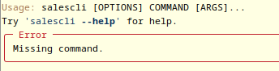

And if you check the location where you run that command you should see a file named `sales.db` has been generated. This is the database file generated by the SQLite3 module.

Next let use `help` command to see the list of command available for this CLI.

```bash
salescli --help
```
You should see the `help` menu as follow.

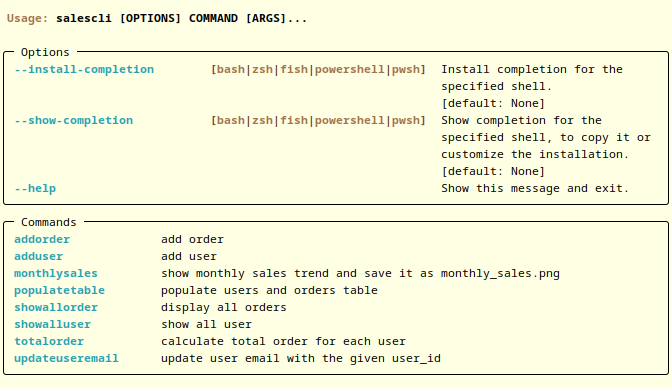

For more detailed help on each command type `salescli command --help`, for example to show detailed help on `adduser` command we can do the following.

```bash
salescli adduser --help
```

And this detailed help will appear.

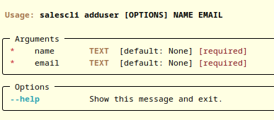

## Adding User

To add user use `adduser` command followed by name and email.

```bash
salescli adduser "John Doe" johndoe@example.com
```

Notice that you need to put the name inside quotation mark as it contains space character. If you do not do this the app will recognize `John` as name, `Doe` as email, and the `johndoe@example.com` as unexpected argument and thus return an error.

If the app run correctly you will get the following message.

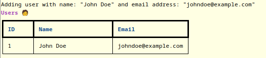

## Adding Order

To add user use `addorder` command followed by product name, date in ISO format, and user_id that correspond to the user whose order belong to.

```bash
salescli addorder computer 2023-12-08 1
```

Then the following message should appear.

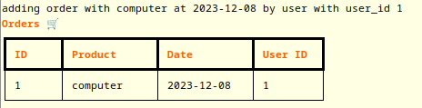

## Update User email

To update user email use `updateuseremail` command followed by user_id of the user that you would like to update then followed by the new email address.

```bash
salescli updateuseremail 1 johndoe@gmail.com
```

And voila! The email is getting updated.

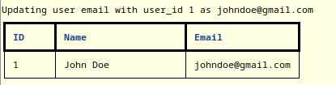

## Populate User and Order table

The next three feature is related to data analysis. Therefore we would like to populate the User and Order table with mock data. Before we populate the table lets delete the database first. You can use `rm sales.db` command in Linux, or you can delete it from File browser of your choice.

If you done deleting the database let start a new database and populate it using the `populatetable` command.

```bash
salescli populatetable
```

To check if the tables have been populated lets check the tables using `salescli showalluser` and `salescli showallorder` command. The first command should show all the user from the mock data.

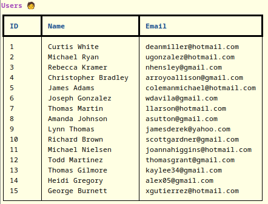

While the second command should show all the order from the mock data.

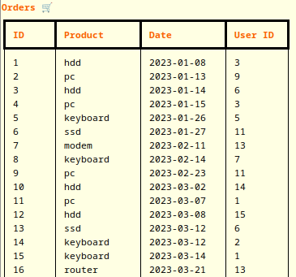

## Calculate total Order for each User

Now that we got our tables populated we can start analyzing the data by calculating the total order for each user using the `salescli totalorder` command, which will give the following output.

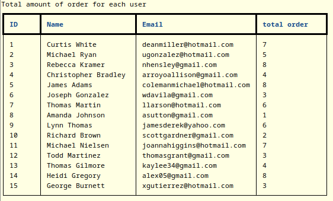

## Filter User based on Total Order

We can also filter the user based on the total order with `--higher-than` and `--lower-than` option. For example if we would like to filter the user that have the total order higher than 5 then we can use the command `salescli totalorder --higher-than 5` which will generate the following output.

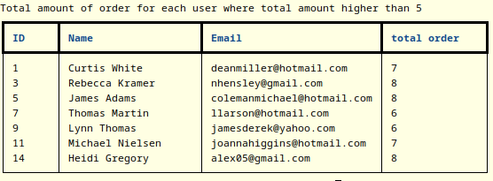

While `salescli totalorder --lower-than 4` will generate the following output.

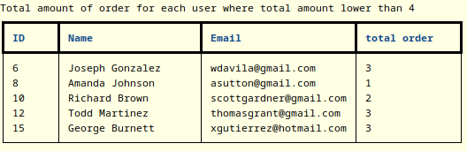

## Generate Monthly Sales Trend

To see the monthly sales trend you can use the command `salescli monthlysales` which will generate `monthly_sales.png` like in the following example.

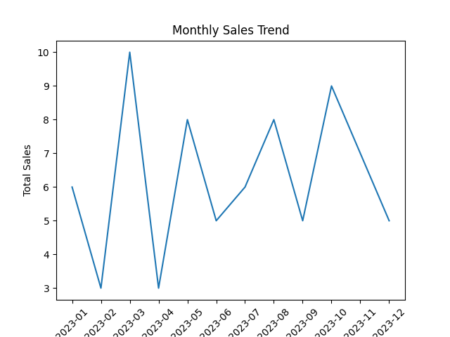

## License

`sales-typer-sqlite` was created by Muhammad Radifar. It is licensed under the terms of the MIT license.